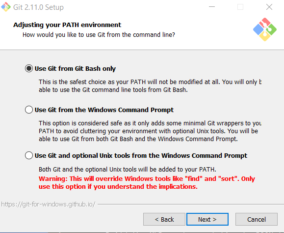

# Install Git Software / Command Line Software

Git command-line tools are useful when using Git commands from a terminal window.
The following choices will also install stand-alone graphical user interface (GUI) tools,
meaning that the tools are not part of an integrated developer environment.

See the [Getting Started - Installing Git](https://git-scm.com/book/en/v2/Getting-Started-Installing-Git) documentation.

* [Install Git on Cygwin](#install-git-on-cygwin)
* [Install Git on Linux](#install-git-on-linux)
* [Install Git on Windows](#install-git-on-windows)

## Install Git on Cygwin

Install Git on Cygwin using the normal Cygwin setup program and select the git tools from the ***Devel*** software group.

## Install Git on Linux

Install Git on Linux using:

```
$ sudo apt-get update
$ sudo apt-get install git-all
```

## Install Git on Windows

Git for Windows is available as a standard installer and includes Git Bash and Git GUI.

Determine whether Git for Windows is installed by looking for Git in the ***Windows Start*** menu.

The following is the installer for Git for Windows, which will install
the command-line Git BASH shell and interactive Git GUI.

* [Git for Windows Download](https://git-for-windows.github.io/) - 64-bit Windows installer

The following example installs Git on Windows 10.  Run the installer.


Research indicates that although it may be possible to install Git software in another folder,
installing under the user files may be only option, so use the default.


The following setting is recommended and will require using Git BASH or Git GUI from the ***Windows Start*** menu.



The following setting ensures that text files in the Git repository will end with LF character and allow
files on the file system to use normal Windows CRLF characters.
This facilitates collaboration between developers on different operating systems.


The following setting provides better behavior when using Git BASH.


The following settings allow for advanced use, although that is not expected on this project.


Do not use experimental features.


After installing, Git BASH can be run from the start menu to provide a Linux-like terminal window to run Git commands.
Git GUI can also be run to provide an interactive interface.

## Next Steps

After installing Git, the software needs to be configured to reflect developer name and preferences.
