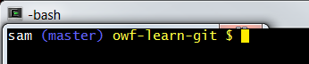

# Git Resources

Need to list here useful Git resources including third-party cheat sheets,
template .gitignore and .gitattribute files in GitHub.

**TODO smalers 2017-01-16 maybe include this in overview**

This documentation includes the following sections:

* [Bash Utilities](#bash-utilities)
	+ [Auto-Completion with `git-completion.bash`](#auto-completion-with-git-completionbash)
	+ [Set Prompt to Indicate Repository Information with `git-prompt.sh`](#set-prompt-to-indicate-repository-information-with-git-promptsh)

## Bash Utilities

The following are useful Bash utilities.
Note that the utilities may need to be configured multiple times depending on development environment,
for example for Cygwin, Linux, Git Bash.

Use of the `git-completion.sh` and `git-prompt.sh` tools was described in the following Udacity Git training course:
[Udacity:  How to Use Git and GitHub](https://www.udacity.com/course/how-to-use-git-and-github--ud775)

The recommendation is to put the following in the software developer's `.bashrc` file (executed for interactive shells),
where the `.bashrc` should be sourced from the `.bash_profile` or `.profile` (`source ~/.bashrc`).
The following calls the `git-completion.bash` and `git-prompt.sh`
scripts that are described in the following subsections.
Local modifications can be made by the developer.
The following example assumes that the scripts are saved to the `~/bin` folder for the software developer.

**Note that Git for Windows (Git Bash) may include this already and so there may only be a need to customize as desired
by editing the `.bash_profile`.**

The functionality has been tested in Cygwin, Git Bash, and Debian Linux.

```
# Enable tab completion
source ~/bin/git-completion.bash

# Enable git-aware command prompt.
# See:  http://tldp.org/HOWTO/Bash-Prompt-HOWTO/x329.html
# https://tiswww.case.edu/php/chet/bash/bashref.html#Controlling-the-Prompt
cyan="\[\033[0;36m\]"
blue="\[\033[0;34m\]"
green="\[\033[0;32m\]"
lightblue="\[\033[1;34m\]"
pink="\[\033[0;31m\]"
purple="\[\033[0;35m\]"
white="\[\033[1;37m\]"
yellow="\[\033[1;33m\]"
# reset switches back to regular color
reset="\[\033[0m\]"

# Change command prompt
source ~/bin/git-prompt.sh
export GIT_PS1_SHOWDIRTYSTATE=1
# '\u' adds the name of the current user to the prompt
# '\$(__git_ps1)' adds git-related stuff
# '\W' adds the name of the current directory
# Prompt will be:
#  user (branch) directory $
# where branch may be followed by:
#  * if unstaged files
#  + if staged files
export PS1="$white\u$lightblue\$(__git_ps1)$yellow \W $ $reset"
# END GIT INSERT
```

The resulting command prompt appears similar to the following:



### Auto-Completion with `git-completion.bash`

To enable auto-completion of Git commands, use the `git-competion.bash` script.  See:

* [Git Basics - Tips and Tricks](https://git-scm.com/book/en/v1/Git-Basics-Tips-and-Tricks)
* [git-completion.bash](https://github.com/git/git/blob/master/contrib/completion/git-completion.bash)


### Set Prompt to Indicate Repository Information with `git-prompt.sh`

It can be confusing to know what branch is being edited with command-line tools,
especially after being away from a project for awhile.  The `git-prompt` bash script provides context when
working on the command line in a specific folder.
Download from the following:

* [git-prompt.sh](https://github.com/git/git/blob/master/contrib/completion/git-prompt.sh)
